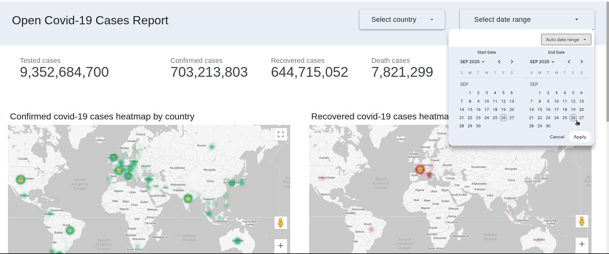
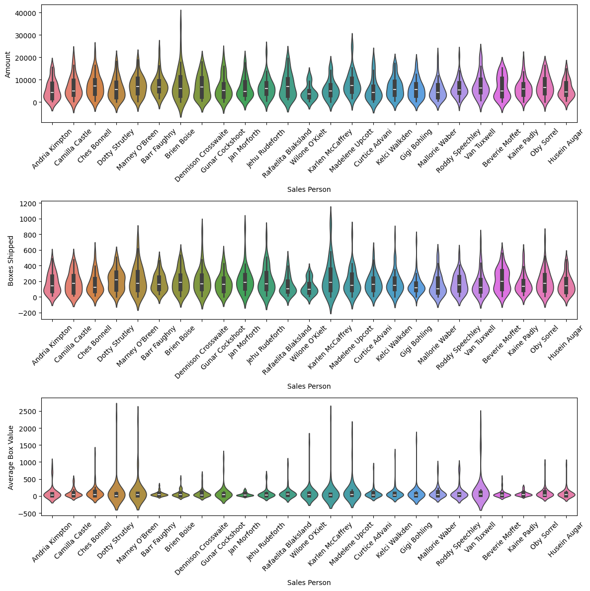
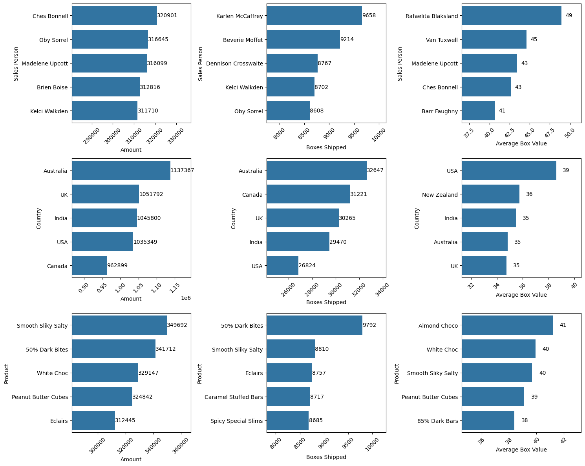

# Data Analytics Projects Portfolio

### A brief introduction of myself
I am **Jason Riady Zelin**, an analytics enthusiast and professional with **5+ years** of experience in the world of data and tech companies. You can visit my page on [Linkedin](https://linkedin.com/in/jason-zelin) and connect with me or for more information about my career journey.

### The following are a showcase glimpse of my data analytics porftolio
### - **Looker Studio**

- [Open Covid-19 Cases Report Dashboard](https://lookerstudio.google.com/reporting/811fe60f-c3a5-452d-8fd6-64c96e67996b) 

### - **Python**
- [Australia Water Quality Exploratory Analysis](https://github.com/jasonzelin/data-analytics-portfolio/tree/main/australia_water_quality_monitoring) 

- [Chocolate Sales Data Analysis](https://github.com/jasonzelin/data-analytics-portfolio/tree/main/chocolate_sales_data) 

