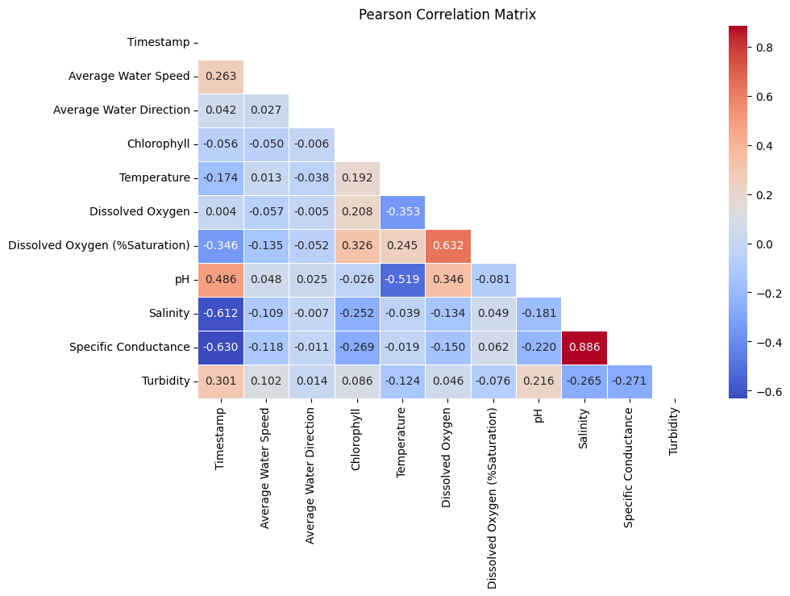
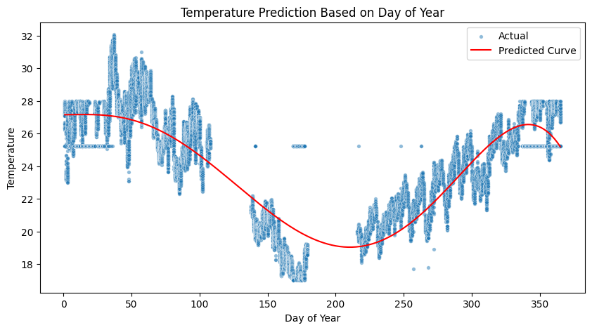

# 🚿 Australia Water Quality Monitoring
## 📌 Project Overview

This project has the purpose to demonstrate a simple data ETL pipeline using a series of tech stacks, which also acts as a portfolio project.

## 📂 Project Structure
    ├── data/                     # Containing the raw data file
    ├── notebook.ipynb            # Jupyter notebook with pipeline code
    └── README.md                 # This file

## ⚙️ Project Breakdown

### 1. Exploratory Data Analysis (EDA)
- Data cleaning:handling missing/null values, outliers, and data type casting.
- Visualizing temporal water quality trends.
- Checking Pearson correlation matrix.

### 2. Feature Engineering
- Normalization/scaling of temporal variables to annual cycles

### 3. Predictive Analysis
- Defined hypothesis from the conducted EDA.
- Modeled the prediction algorithm using polynomial features.
- Evaluation of the model prediction accuracy.

### 4. Insights and Recommendations
- Identified several variables that have relatively strong correlation with the annual cycle in Australia, which are **Temperature, pH and Salinity**
- Finetuned a prediciton model using polynomial model with degree of 5 and **89%** of accuracy.

## 🚀 Tech Stack
All the stacks used for this project are python-based compiled in Jupyter Notebook IDE. The python packages used for each specific purpose are as follows:
- **EDA**: pandas, numpy, regex
- **Data Viz**: matplotlib, seaborn
- **Prediction Modeling**: scikit-learn

## 📊 Example Outputs

## 🏗️ How to Run Locally

Clone this repo:

    git clone https://github.com/jasonzelin/data-analytics-portfolio.git
    cd data-analytics-portfolio/australia_water_quality_monitoring

Create virtual environment & install dependencies:

    python -m venv venv
    source venv/bin/activate   # For Linux/Mac OS
    venv\Scripts\activate      # For Windows OS
    pip install -r requirements.txt

Run Jupyter Notebook:

    jupyter notebook

Open **`notebook.ipynb`** and execute cells.

## 🙌 Acknowledgements

- [Australian Government - Water Quality Data](https://www.data.gov.au/): for providing open datasets.

- **Open Source Python Packages**: pandas, numpy, re, matplotlib, seaborn, scikit-learn